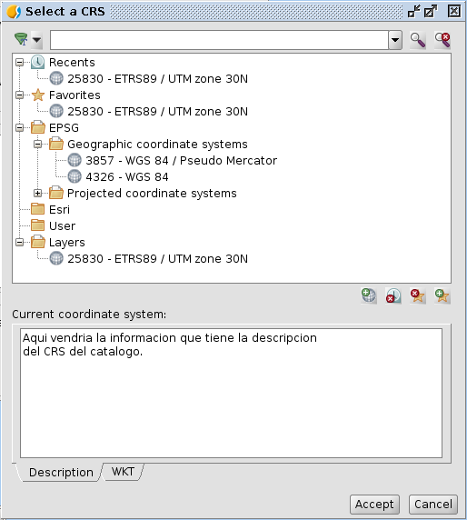

 
Proptotipo de panels para CRS
==================================

Aqui se pueden ver los prototipos de los paneles a usar en la
nueva interface grafica de manejo de proyecciones.

Los paneles que deberian existir en el API de proyecciones
serian:

- `Seleccionar un CRS<docs/crsselector.rst>`_.
- Seleccionar una transformacion.
- Dar de alta un CRS de usuario

