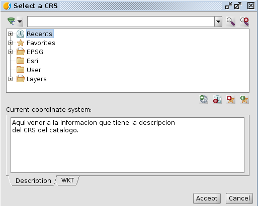

 
API CRS Selector
=================

El API de este panel estara representado por un Interface java que
extienda de Component (de org.gvsig.tools.swing).

Este panel permitira:

- Mantener una lista de "custom CRS". 

  Esta lista se presentara en la ultima rama del tree, y se le 
  podra asignar una etiqueta. Si no se le asigna una etiqueta
  usara "Custom". No se presentara la rama en el tree si esta vacia.

  Por ejemplo, se podria hacer algo como::

    panel.setCustomCRSsLabel("Layers")
    for layer in iter(mapContext.deepIterator()):
      panel.addCustomCRS(layer.getProjection())
      
  En caso que se añadan CRS duplicados a la lista de CRS custom
  se ignoraran los duplicados, no añadiendose a la lista.

  Habria que ver de añadir metodos para acceder a la estos atributos,
  algo como:

  - String getCustomCRSsLabel()
  - List<IProjection> getCustomCRSs()

    Que devolveria una lista inmutable de esos CRS. No se si seria
    interesante que devolviese directamente un List o un OrderedSet.

- Mantener una lista de "encuadres", Envelope, a usar en el filtro 
  espacial. 

  Por ejemplo, se podria hacer algo como::

    panel.addCRSSpatialFilter("Current Visible Extent", currentView().getEnvelope())

  No añadiria filtros duplicados por nombre. Y habria que añadir algun getter,
  por ejemplo:

  - Map<String,IProjection> getCRSSpatialFilters()

  Internamente habria que ver si deberia respetar el orden por el que se han
  añadido los filtros o si se ordenan por orden alfabetico.

  Tambien habria que ver en que CRS estan esos "encuadres". Supongo que se 
  precisara que esten en 4326.
  
Tambien deberia tener un metodo algo como::

  void addCRSSelectionListener(ActionListener listener)

Para escuchar cuando se va seleccionando una proyeccion en el tree (usar
ActionListenerSupport de tools.swing).

Por defecto en el dialogo estara activada la busqueda por texto, 
y se presentara el arbol con las ramas colapsadas viendose solo las
de:

- Reciente
- favoritos
- Una rama por authority
- Y la rama custom si tiene elementos.

Si el usuario expande las ramas navegara por toda la BBDD del catalogo
de proyecciones.

Si el usuario introduce un filtro (alphanumerico o espacial) la informacion
a presentar en el arbol se restringira a las proyecciones que cumplan
el criterio.

Se utilizara el boton de la lupa con el aspa roja para eliminar el criterio
de filtro y volver a navegar por toda la BBDD del catalogo.

Se incluiran metodos como::

  public IProjection getProjection()

  public void setProjection(IProjection projection)

  public void setCRSSpatialFilter(String filter)

  public String getCRSSpatialFilter()

  public void setCRSAlphaFilter(String filter)

  public String getCRSAlphaFilter()

  public void applyCRSFilyer()

Los metodos setXXXCRSFilter asignan el filtro y con applyFilter se aplicaria.

El metodo getProjection seria el metodo usado para recuperar la proyeccion 
seleccionada por el usuario.

Para el JTree se utilizara un TreeNode especifico, que se encargue de manejar
las listas de proyecciones al vuelo, y no el DefaultMutableTreeNode
que forzaria a cargar todas las proyecciones en memoria.

